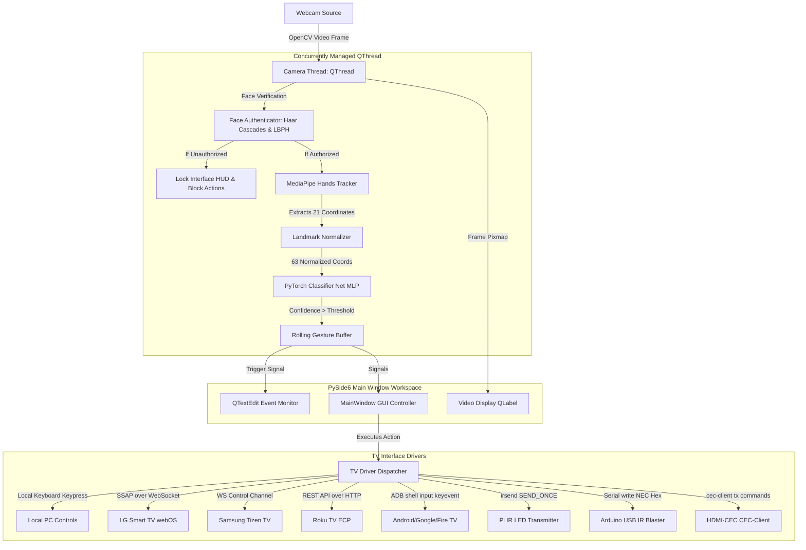

# AuraCast: Cross-Platform AI Smart TV Desktop Controller

AuraCast is a state-of-the-art, GPU-accelerated **PySide6 Desktop Application** that replaces traditional TV remotes with real-time AI hand gesture tracking. Powered by MediaPipe hand landmark tracking, a PyTorch MLP classification model, and a facial recognition security layer, AuraCast translates intuitive hand poses into TV actions (Power, Volume, Mute, Channel, Play/Pause, Navigation, App Launchers) and supports traditional IR, modern Smart TV Wi-Fi, Bluetooth, and HDMI-CEC control layers.

---

## 1. System Architecture



---

## 2. Hardware Requirements

### Base Controller (Processing Host)
* **Raspberry Pi 5** (8GB or 4GB RAM) or **Windows PC / Linux PC / Mac**
* **Camera**: Built-in laptop webcam or external USB webcam

### Infrared (IR) Transmitter Circuit (For Traditional TVs)
If controlling a traditional TV that requires an IR Remote Control, build this circuit:
* **IR LED**: 940nm Infrared LED transmitter
* **NPN Transistor**: PN2222, 2N3904, or BC547 (acts as a high-current switch for the IR LED)
* **Resistors**: 
  * `220 Ohm` (limits current going through the IR LED)
  * `10k Ohm` (connects base of the transistor to GPIO to limit GPIO output current)
* **Breadboard & Jumper wires** (M-to-F for Raspberry Pi)

---

## 3. IR Transmitter Circuit Diagram (Raspberry Pi GPIO)

```
                       +5V / +3.3V (Pin 2 or 4 on RPi)
                             |
                             |
                            [ ] 220 Ohm Resistor
                             |
                             |
                           +---+
                            \ /  IR LED (940nm)
                           -----
                             |
                             | (Collector)
                        +----+
                        |
GPIO 18 ---------------+ [   ] NPN Transistor (PN2222)
(Pin 12)  [ 10k Ohm ]   +----+
          Resistor        | (Emitter)
                             |
                             |
                            GND (Pin 6 on RPi)
```

### Connection Table:
1. **Transistor Collector**: Connected to the cathode (shorter pin) of the **IR LED**.
2. **IR LED Anode** (longer pin): Connected to the **220 Ohm resistor**, which connects to **5V** (or 3.3V) on the Raspberry Pi (Pin 2 or 4).
3. **Transistor Emitter**: Connected directly to **GND** on the Pi (Pin 6).
4. **Transistor Base**: Connected via the **10k Ohm resistor** to **GPIO 18** (Pin 12) of the Raspberry Pi.

---

## 4. Setup & Deployment Guide

### A. General Installation (Windows, Linux, macOS, Raspberry Pi OS)

1. **Clone or copy the project files** to your workspace folder: `E:/Gesture Control/`
2. **Install Python 3.9+** on your machine.
3. **Open a terminal** and install the dependencies:
   ```bash
   pip install -r requirements.txt
   ```
4. **Initialize the default dataset and model**:
   ```bash
   python backend/generate_default_dataset.py
   ```
   This creates a pre-trained model on synthetic data so the system works out-of-the-box.

5. **Start the Desktop Application**:
   ```bash
   python app_gui.py
   ```

---

## 5. Advanced Configuration & Features

### A. Facial Lockout Security (Face Recognition)
1. Go to the **Settings** tab in the desktop application.
2. Click **Register Facial Profile**.
3. Position your face in front of the camera. The system will collect 30 frames and write a local configuration file to `data/faces/face_model.xml` using OpenCV's local binary pattern histogram algorithm.
4. Check **Enable Facial Lockout Security**. The gesture controls will be disabled and locked out until the camera recognizes your face, preventing accidental inputs from guests or unauthorized family members.

### B. Auto-Detecting Subnet TVs
1. Under the **Settings** tab, choose **Wi-Fi** as your active connection driver.
2. Click **Scan Network Subnet for TVs**.
3. The application will asynchronously scan standard ports (Roku `8060`, Samsung `8001`, LG `3000`, ADB `5555`) on your local IP range.
4. Once detected, the TV IP and type will automatically populate the settings layout. Click **Apply Settings** to save.

---

## 6. Standalone Packaging (Generating Installers)

To compile the application into a standalone binary (.exe on Windows, executable folder on Linux/Mac/Pi) that operates with zero python installation requirements:

1. Execute the packaging compiler utility:
   ```bash
   python package.py
   ```
2. PyInstaller will parse all packages (PySide6, PyTorch, MediaPipe, OpenCV, qasync), bundle the required model assets (`hand_landmarker.task`, `face_model.xml`, and Haar Cascade directories), and output the bundle directory:
   * **Distribution folder**: `dist/AuraCast/`
   * Run the standalone executable `AuraCast.exe` (or unix binary) directly from the folder.
   
*To compile into macOS `.dmg` or Linux `.deb` installer packages, use PyInstaller's packaging wrappers or execute native compilation scripts inside the target operating systems.*

---

## 7. Future Roadmap

1. **Voice Commands Extension**: Adding local offline keywords (using pocketsphinx or Vosk) to pair voice overrides with hand gestures.
2. **Dynamic Air Mouse**: Utilizing index finger tracking coordinates relative to the screen to act as a gyro pointer for smart TV web browsers.
3. **Dual-Hand Logic**: Pairing hands together to expand gesture mapping vocabulary (e.g. Left hand holds a volume key symbol, right hand drags up/down to scroll volume level).
